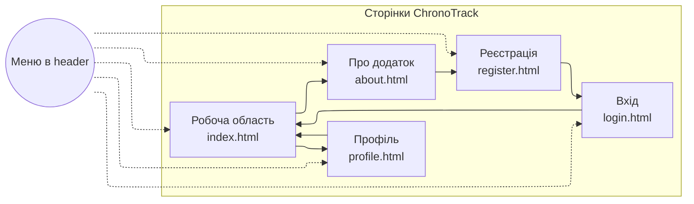

# Лабораторна робота №1 — Розробка статичного інтерфейсу Web-додатка

**Варіант:** Облік робочого часу (запуск таймера, призупинення/продовження, зупинка, збереження назви, часу початку і завершення сеансу роботи)

**Назва Web-додатка:** ChronoTrack

## Зміст
* [Мета](#мета)
* [Опис та задумка проєкту](#опис-та-задумка-проєкту)
* [Архітектура та структура проєкту](#архітектура-та-структура-проєкту)
* [Сторінки та їх призначення](#сторінки-та-їх-призначення)
* [Дизайн і стилістика](#дизайн-і-стилістика)
* [Схема навігації (diagram)](#схема-навігації-diagram)
* [Контакти](#контакти)

## Мета
Ознайомитись із засобами HTML5 та CSS3 та навчитись застосовувати бібліотеки (Bootstrap) для швидкої побудови статичного Web-інтерфейсу користувача. Забезпечити коректне відображення сторінок на екранах різного розміру (телефон, планшет, ПК).

## Опис та задумка проєкту
ChronoTrack — це Web-інтерфейс тайм-трекера для візуального обліку робочого часу. Концепція — максимально простий та читабельний інтерфейс для фіксації сесій роботи: назва задачі, час початку/завершення, тривалість та історія сесій у таблиці.

## Архітектура та структура проєкту

**Структура репозиторію:**
- `Site/` — основні HTML-сторінки та стилі
  - `index.html` — робоча область (таймер + історія сесій)
  - `profile.html` — профіль користувача + статистика
  - `about.html` — опис додатка та емблема
  - `login.html` — форма входу
  - `register.html` — форма реєстрації
  - `styles.css` — власні стилі
  - `logo.png` — емблема проєкту
- `README.md` — опис проєкту

## Сторінки та їх призначення
- **Робоча область (`index.html`)**: форма “Поточна сесія” (назва задачі, час старту/завершення, таймер) і таблиця “Історія сесій”.
- **Профіль (`profile.html`)**: дані користувача у табличному вигляді + блок “Статистика”.
- **Про додаток (`about.html`)**: емблема, короткий опис призначення та ключові переваги. 
- **Вхід (`login.html`)**: форма входу (email + пароль).
- **Реєстрація (`register.html`)**: форма реєстрації (ім’я, email, стать, дата народження).

## Дизайн і стилістика
Всі сторінки мають єдину структуру: **header + меню**, **основний контент**, **footer**. Для візуального оформлення використано:
- шрифт **Manrope**;
- сітку і компоненти **Bootstrap 5**;
- власні стилі у `styles.css`

Адаптивність забезпечена сіткою Bootstrap та media-запитами, що коректно відображають меню і контент на різних екранах.

## Схема навігації (diagram)

## Контакти
* **Автор:** Протченко П.О., група **КВ-34**
* **Telegram:** [@PR0TX](https://t.me/PR0TX)
