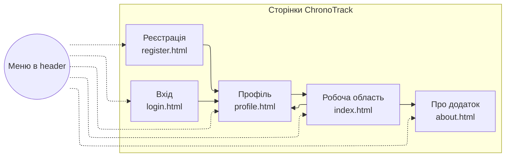
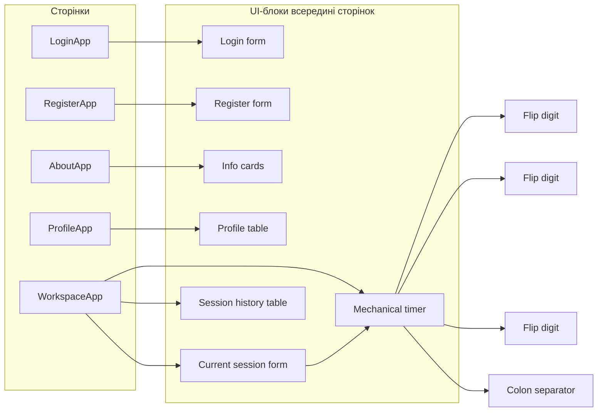
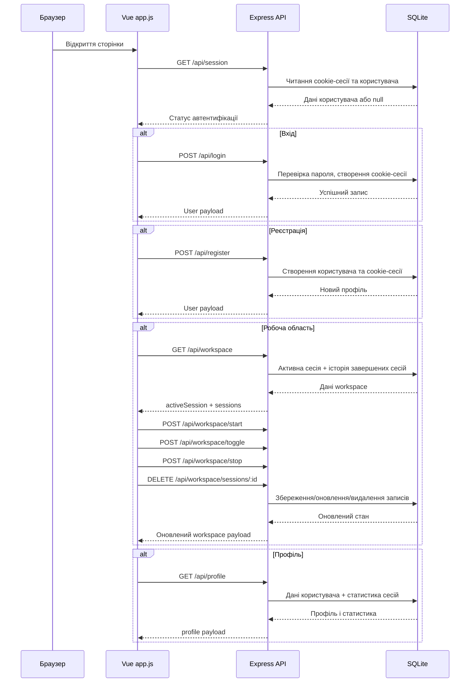

# Лабораторна робота №3 — Розробка Web-додатка засобами Javascript/VueJS

[](https://developer.mozilla.org/en-US/docs/Web/HTML)
[](https://developer.mozilla.org/en-US/docs/Web/CSS)
[](https://developer.mozilla.org/en-US/docs/Web/JavaScript)
[](https://vuejs.org/)
[](https://nodejs.org/)
[](https://expressjs.com/)
[](https://www.sqlite.org/)
[](https://getbootstrap.com/)
[](https://fonts.google.com/specimen/Manrope)

**Варіант:** Облік робочого часу (запуск таймера, призупинення/продовження, зупинка, збереження назви, часу початку і завершення сеансу роботи)

**Назва Web-додатка:** ChronoTrack

## Зміст
* [Мета](#мета)
* [Завдання лабораторної](#завдання-лабораторної)
* [Опис проєкту](#опис-проєкту)
* [Архітектура та структура проєкту](#архітектура-та-структура-проєкту)
* [Сторінки та їх призначення](#сторінки-та-їх-призначення)
* [Схема навігації](#схема-навігації)
* [Взаємодія компонентів у сторінках](#взаємодія-компонентів-у-сторінках)
* [Потік даних і подій](#потік-даних-і-подій)
* [Логіка Javascript-коду](#логіка-javascript-коду)
* [Використані технології](#використані-технології)
* [Запуск проєкту](#запуск-проєкту)
* [Контакти](#контакти)

## Мета
Ознайомитись із засобами фреймворка VueJS та навчитись створювати асинхронні запити до Web-сервера.

## Завдання лабораторної
Адаптувати програмний код ЛР№2 до вимог фреймворка VueJS та забезпечити завантаження необхідних даних з Web-сервера 

## Опис проєкту
ChronoTrack — це Web-додаток для обліку робочого часу. У ньому можна запускати таймер для задачі, призупиняти та продовжувати роботу, завершувати сесію із збереженням часу початку, часу завершення та тривалості, а також переглядати профіль користувача і статистику накопичених сесій.

Клієнтська частина побудована на VueJS і працює через асинхронні запити до Express-сервера. Сервер зберігає користувачів, активні сесії та історію роботи в SQLite-базі.

## Архітектура та структура проєкту

**Структура репозиторію:**
- `Site/` — сторінки та ресурси Web-додатка
  - `index.html` — робоча область з таймером і історією сесій
  - `profile.html` — профіль користувача та статистика
  - `about.html` — сторінка з описом додатка
  - `login.html` — форма входу
  - `register.html` — форма реєстрації
  - `styles.css` — стилі інтерфейсу
  - `logo.png` — емблема додатка
  - `js/app.js` — єдина точка входу Vue-клієнта, яка керує всіма сторінками
- `server.js` — сервер Express, REST API та робота з SQLite
- `package.json` — конфігурація npm-скриптів і залежностей
- `package-lock.json` — зафіксовані версії залежностей
- `README.md` — опис проєкту

## Сторінки та їх призначення
- **Робоча область (`index.html`)**: запуск таймера, призупинення/продовження, зупинка сесії, відображення поточного стану сесії та історії збережених записів.
- **Профіль (`profile.html`)**: табличне подання даних користувача, кнопка виходу та автоматичний підрахунок статистики на основі завершених робочих сесій.
- **Про додаток (`about.html`)**: статичний опис додатка, його призначення та ключових можливостей.
- **Вхід (`login.html`)**: форма входу, яка надсилає email і пароль на сервер та отримує серверну сесію.
- **Реєстрація (`register.html`)**: форма реєстрації з валідацією полів і автоматичним входом після успішного створення облікового запису.

## Схема навігації


## Взаємодія компонентів у сторінках



## Потік даних і подій




## Логіка Javascript-коду
Код проєкту побудовано без `MVC`-шару з ЛР№2. Замість нього використано компактну структуру:
- `Site/js/app.js` містить Vue-логіку для всіх сторінок, форматування дат і часу, а також виклики `fetch` до серверного API;
- `server.js` реалізує Express-сервер, перевірку автентифікації, обробку форм входу і реєстрації, а також CRUD-операції для робочих сесій;
- SQLite використовується як постійне сховище для користувачів, сесій входу та історії робочого часу.

На клієнті Vue керує відображенням сторінок, станом форм, повідомленнями про помилки та таблицями сесій. На сервері дані проходять валідацію, після чого зберігаються або оновлюються в базі даних. Для авторизації використано серверну cookie-сесію.

### Робоча область
На сторінці `index.html` Vue-клієнт завантажує стан поточного користувача та список сесій з `/api/workspace`. Після цього доступні дії:
- `startSession()` запускає нову сесію;
- `toggleSession()` призупиняє або продовжує активну сесію;
- `stopSession()` завершує сесію та переносить її до історії;
- `deleteSession()` видаляє запис із таблиці історії.

Щосекунди оновлюється відображення таймера, але фактичні дані зберігаються на сервері.

### Профіль користувача
На сторінці `profile.html` завантажуються дані профілю та статистика з `/api/profile`. Після отримання відповіді від сервера відображаються:
- основні дані користувача;
- загальна тривалість роботи;
- середня тривалість сесії;
- кількість завершених сесій.

### Вхід і реєстрація
Форми `login.html` і `register.html` відправляють дані через `fetch` на серверні маршрути `/api/login` та `/api/register`. Після успішної операції сервер встановлює cookie, а клієнт переадресовується на сторінку профілю.

### Сервер
`server.js`:
- створює таблиці `users`, `auth_sessions`, `active_sessions` і `work_sessions`;
- заповнює базу демо-даними при першому запуску;
- перевіряє пароль та створює серверну сесію;
- зберігає та оновлює активну робочу сесію;
- формує дані для профілю та історії.

## Використані технології
- `HTML5`, `CSS3`
- `Bootstrap 5.3.2`
- `JavaScript ES6`
- `VueJS 3`
- `Motion for Vue (motion-v)`
- `NodeJS`
- `Express`
- `SQLite`
- `fetch API`
- `npm`
- шрифт `Manrope`

## Запуск проєкту
1. Встановити залежності:
```bash
npm install
```

2. Запустити сервер:
```bash
npm start
```

3. Відкрити сайт у браузері:
```bash
http://localhost:3000
```

Для швидкої перевірки доступний демо-акаунт:
- `demo@chronotrack.local`
- `Demo12345!`

## Контакти
* **Автор:** Протченко П.О., група **КВ-34**
* **Лабораторна робота:** №3, Web-дизайн
* **Завдання:** Розробка Web-додатка засобами Javascript/VueJS
* **URL звіту (Google Drive):** [Переглянути звіт](https://docs.google.com/document/d/18HFXQSwxrTMs08vbavuD73HtkpM9TyB-/edit?usp=sharing&ouid=109306955313039128869&rtpof=true&sd=true)
