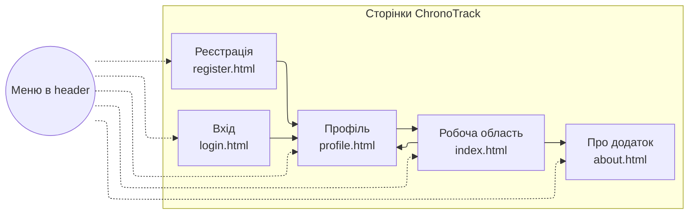
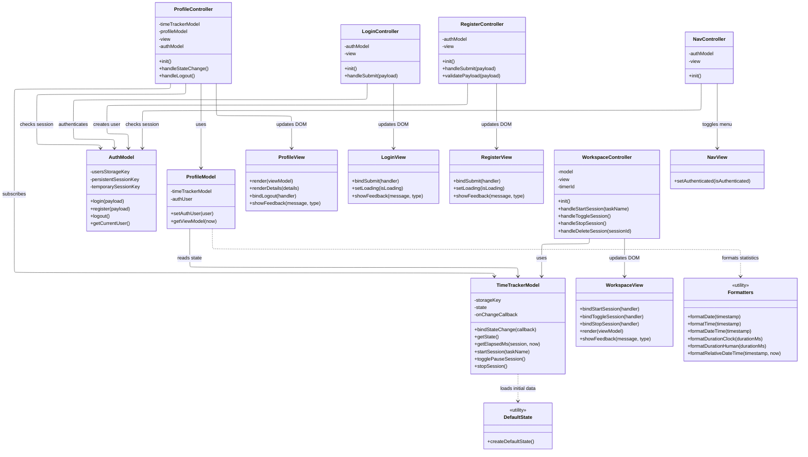

# Лабораторна робота №2 — Розробка функціональності Web-додатка мовою Javascript

**Варіант:** Облік робочого часу (запуск таймера, призупинення/продовження, зупинка, збереження назви, часу початку і завершення сеансу роботи)

**Назва Web-додатка:** ChronoTrack

## Зміст
* [Мета](#мета)
* [Завдання лабораторної](#завдання-лабораторної)
* [Опис проєкту](#опис-проєкту)
* [Архітектура та структура проєкту](#архітектура-та-структура-проєкту)
* [Сторінки та їх призначення](#сторінки-та-їх-призначення)
* [Схема навігації](#схема-навігації)
* [Діаграма класів Javascript-додатку](#діаграма-класів-javascript-додатку)
* [Логіка Javascript-коду](#логіка-javascript-коду)
* [Використані технології](#використані-технології)
* [Контакти](#контакти)

## Мета
Ознайомитись із засобами мови Javascript та навчитись застосовувати їх для побудови клієнтського Web-інтерфейсу користувача за шаблоном MVC.

## Завдання лабораторної
Розробити функціональність для статичних сторінок Web-додатка з першої лабораторної роботи за допомогою Javascript без використання фронтенд-фреймворків. Код організовано у вигляді модулів `model`, `view`, `controller`, а для збереження даних використано `localStorage` і `sessionStorage`.

## Опис проєкту
ChronoTrack — це Web-додаток для обліку робочого часу. Користувач може запускати таймер для задачі, призупиняти та продовжувати сесію, зупиняти її із збереженням початку, завершення та тривалості, а також переглядати накопичену статистику у профілі. Вхід і реєстрація реалізовані у демонстраційному клієнтському режимі без окремого сервера, тому сайт коректно працює як статичний проєкт на GitHub Pages.

## Архітектура та структура проєкту

**Структура репозиторію:**
- `Site/` — сторінки та ресурси Web-додатка
  - `index.html` — робоча область з таймером
  - `profile.html` — профіль користувача і статистика
  - `about.html` — сторінка з описом додатка
  - `login.html` — форма входу
  - `register.html` — форма реєстрації
  - `styles.css` — стилі інтерфейсу
  - `logo.png` — емблема додатка
  - `js/main.js` — точка входу Javascript-модулів, яка ініціалізує потрібну сторінку
  - `js/controller/WorkspaceController.js` — контролер робочої сторінки
  - `js/controller/ProfileController.js` — контролер сторінки профілю
  - `js/controller/LoginController.js` — контролер сторінки входу
  - `js/controller/RegisterController.js` — контролер сторінки реєстрації
  - `js/controller/NavController.js` — контролер перемикання пунктів меню залежно від стану входу
  - `js/model/TimeTrackerModel.js` — модель сесій, активного таймера та `localStorage`
  - `js/model/ProfileModel.js` — модель підготовки статистики і даних профілю
  - `js/model/AuthModel.js` — модель локальної авторизації та реєстрації
  - `js/view/WorkspaceView.js` — відображення робочої сторінки та таблиці історії
  - `js/view/ProfileView.js` — відображення профілю та блоку статистики
  - `js/view/LoginView.js` — відображення сторінки входу
  - `js/view/RegisterView.js` — відображення сторінки реєстрації
  - `js/view/NavView.js` — відображення стану навігаційного меню
  - `js/data/defaultState.js` — початкові демонстраційні дані додатка
  - `js/utils/formatters.js` — функції форматування дат, часу та тривалості
- `README.md` — опис проєкту

## Сторінки та їх призначення
- **Робоча область (`index.html`)**: запуск таймера, призупинення/продовження, зупинка сесії, автоматичне збереження у `localStorage`, відображення історії сесій у таблиці та видалення окремих записів з історії.
- **Профіль (`profile.html`)**: табличне подання даних поточного локально авторизованого користувача, кнопка виходу та автоматичний підрахунок статистики на основі збережених сесій.
- **Про додаток (`about.html`)**: статичний опис додатка та його можливостей.
- **Вхід (`login.html`)**: форма входу, яка перевіряє користувача за локально збереженими даними і створює демонстраційну сесію в `localStorage` або `sessionStorage`.
- **Реєстрація (`register.html`)**: форма реєстрації з перевіркою полів, створенням нового локального користувача і автоматичним входом після успішної реєстрації.

## Схема навігації

## Діаграма класів Javascript-додатку

## Логіка Javascript-коду
Javascript-код організовано за шаблоном `MVC`, тобто логіка поділена на три частини: `Model`, `View` і `Controller`.

Файл `js/main.js` є точкою входу. Після відкриття сторінки він читає атрибут `data-page` у `<body>` і визначає, яку саме сторінку потрібно ініціалізувати. Для кожної сторінки створюється свій набір моделей, подань і контролерів.

Модель `TimeTrackerModel` є центральним сховищем даних робочої частини додатка. Вона відповідає за:
- список завершених робочих сесій;
- поточну активну сесію;
- технічну синхронізацію стану з `localStorage`.

Під час старту модель або зчитує раніше збережений стан із `localStorage`, або бере початкові демонстраційні дані з `js/data/defaultState.js`. Завдяки цьому після перезавантаження сторінки історія сесій і статистика не зникають.

У моделі реалізовано основні методи роботи з таймером:
- `startSession(taskName)` створює нову активну сесію;
- `togglePauseSession()` перемикає стан між паузою і продовженням;
- `stopSession()` завершує сесію, обчислює її тривалість і переносить запис у загальну історію.

Для автоматичного відстеження змін використано `Proxy`. Коли стан моделі змінюється, модель синхронізує дані з `localStorage` і викликає callback контролера, щоб інтерфейс одразу оновився без перезавантаження сторінки.

`WorkspaceController` керує робочою сторінкою. Він прив’язує кнопки запуску, паузи, продовження та зупинки до методів моделі, перевіряє введену назву задачі, запускає щосекундне оновлення таймера через `setInterval` і готує дані для відображення.

`WorkspaceView` працює тільки з DOM:
- зчитує потрібні елементи інтерфейсу;
- оновлює значення таймера і статусу;
- вмикає або вимикає кнопки залежно від стану сесії;
- будує рядки таблиці історії;
- додає кнопки видалення для кожної завершеної сесії;
- показує службові повідомлення користувачу.

Для авторизації використовується окрема модель `AuthModel`, але вона працює повністю на клієнті. Її задача:
- зберігати список зареєстрованих користувачів у `localStorage`;
- перевіряти email і пароль під час входу;
- зберігати поточну сесію в `localStorage` або `sessionStorage`;
- повертати поточного користувача для сторінки профілю;
- очищати сесію під час виходу.

`LoginController` і `RegisterController` обробляють форми входу та реєстрації. Вони виконують валідацію, передають дані в `AuthModel`, показують повідомлення про помилки або успішне виконання, а потім переадресовують користувача на `profile.html`.

`ProfileController` перевіряє, чи є локально активна сесія. Якщо користувач не увійшов, сторінка показує повідомлення і переадресовує на форму входу. Якщо сесія є, `ProfileModel` об’єднує дані користувача з локальної авторизації та статистику робочих сесій із `TimeTrackerModel`, після чого `ProfileView` відображає їх у таблиці та картках статистики.

Окремо `NavController` перевіряє наявність локальної сесії під час відкриття будь-якої сторінки. Якщо користувач уже увійшов, у верхньому меню приховуються посилання `Вхід` і `Реєстрація`. Після виходу вони знову стають видимими.

Для форматування винесено окремий модуль `js/utils/formatters.js`. У ньому зібрано функції для:
- форматування дати;
- форматування часу;
- форматування тривалості у вигляді `год/хв`;
- форматування таймера у вигляді `HH:MM:SS`;
- побудови відносного часу останньої активності.

Логіка входу і реєстрації в є демонстраційною. Усі дані зберігаються тільки в браузері користувача і не передаються на сервер.

## Використані технології
- `HTML5`, `CSS3`
- `JavaScript ES6 modules`
- шаблон `MVC`
- `Bootstrap 5` для сітки та базових компонентів
- `localStorage` для збереження робочих сесій і зареєстрованих користувачів
- `sessionStorage` для тимчасової локальної сесії входу

## Контакти
* **Автор:** Протченко П.О., група **КВ-34**
* **Telegram:** [@PR0TX](https://t.me/PR0TX)
* **Лабораторна робота:** №2, Web-дизайн
