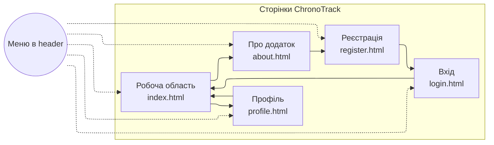
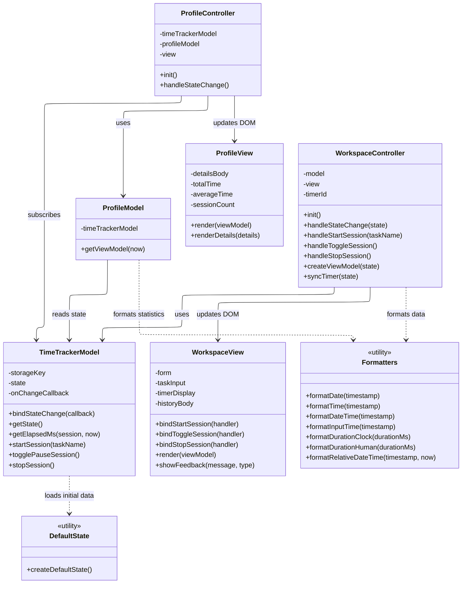

# Лабораторна робота №2 — Розробка функціональності Web-додатка мовою Javascript

**Варіант:** Облік робочого часу (запуск таймера, призупинення/продовження, зупинка, збереження назви, часу початку і завершення сеансу роботи)

**Назва Web-додатка:** ChronoTrack

## Зміст
* [Мета](#мета)
* [Завдання лабораторної](#завдання-лабораторної)
* [Опис проєкту](#опис-проєкту)
* [Архітектура та структура проєкту](#архітектура-та-структура-проєкту)
* [Сторінки та їх призначення](#сторінки-та-їх-призначення)
* [Схема навігації](#схема-навігації)
* [Діаграма класів Javascript-додатку](#діаграма-класів-javascript-додатку)
* [Логіка Javascript-коду](#логіка-javascript-коду)
* [Використані технології](#використані-технології)
* [Контакти](#контакти)

## Мета
Ознайомитись із засобами мови Javascript та навчитись застосовувати їх для побудови клієнтського Web-інтерфейсу користувача за шаблоном MVC.

## Завдання лабораторної
Розробити функціональність для статичних сторінок Web-додатка з першої лабораторної роботи за допомогою Javascript без використання фронтенд-фреймворків. Код організовано у вигляді модулів `model`, `view`, `controller`, а для збереження даних використано `localStorage`.

## Опис проєкту
ChronoTrack — це Web-додаток для обліку робочого часу. Користувач може запускати таймер для задачі, призупиняти та продовжувати сесію, зупиняти її із збереженням початку, завершення та тривалості, а також переглядати накопичену статистику у профілі.

## Архітектура та структура проєкту

**Структура репозиторію:**
- `Site/` — сторінки та ресурси Web-додатка
  - `index.html` — робоча область з таймером
  - `profile.html` — профіль користувача і статистика
  - `about.html` — сторінка з описом додатка
  - `login.html` — форма входу
  - `register.html` — форма реєстрації
  - `styles.css` — стилі інтерфейсу
  - `logo.png` — емблема додатка
  - `js/main.js` — точка входу Javascript-модулів, яка ініціалізує потрібну сторінку
  - `js/controller/WorkspaceController.js` — контролер робочої сторінки
  - `js/controller/ProfileController.js` — контролер сторінки профілю
  - `js/model/TimeTrackerModel.js` — модель сесій, активного таймера та `localStorage`
  - `js/model/ProfileModel.js` — модель підготовки статистики і даних профілю
  - `js/view/WorkspaceView.js` — відображення робочої сторінки та таблиці історії
  - `js/view/ProfileView.js` — відображення профілю та блоку статистики
  - `js/data/defaultState.js` — початкові демонстраційні дані додатка
  - `js/utils/formatters.js` — функції форматування дат, часу та тривалості
- `README.md` — опис проєкту

## Сторінки та їх призначення
- **Робоча область (`index.html`)**: запуск таймера, призупинення/продовження, зупинка сесії, автоматичне збереження у `localStorage`, відображення історії сесій у таблиці.
- **Профіль (`profile.html`)**: табличне подання даних користувача та автоматичний підрахунок статистики на основі збережених сесій.
- **Про додаток (`about.html`)**: статичний опис додатка та його можливостей.
- **Вхід (`login.html`)**: статична форма входу, підготовлена для подальшого розширення.
- **Реєстрація (`register.html`)**: статична форма реєстрації, підготовлена для подальшого розширення.

## Схема навігації

## Діаграма класів Javascript-додатку

## Логіка Javascript-коду
Javascript-код організовано за шаблоном `MVC`, тобто логіка поділена на три частини: `Model`, `View` і `Controller`. 

Файл `js/main.js` є точкою входу. Після відкриття сторінки він дивиться на атрибут `data-page` у `<body>` і визначає, яку саме сторінку потрібно ініціалізувати. Якщо відкрита `index.html`, створюються екземпляри `TimeTrackerModel`, `WorkspaceView` і `WorkspaceController`. Якщо відкрита `profile.html`, створюються `TimeTrackerModel`, `ProfileModel`, `ProfileView` і `ProfileController`.

Модель `TimeTrackerModel` є центральним сховищем даних додатка. Вона зберігає:
- список завершених робочих сесій;
- поточну активну сесію;
- дані профілю користувача.

Під час старту модель або зчитує раніше збережений стан із `localStorage`, або бере початкові демонстраційні дані з `js/data/defaultState.js`. Завдяки цьому після перезавантаження сторінки історія сесій і статистика не зникають.

У моделі реалізовано основні методи роботи з таймером:
- `startSession(taskName)` створює нову активну сесію;
- `togglePauseSession()` перемикає стан між паузою і продовженням;
- `stopSession()` завершує сесію, обчислює її тривалість і переносить запис у загальну історію.

Для автоматичного відстеження змін використано `Proxy`. Коли стан моделі змінюється, модель синхронізує дані з `localStorage` і викликає callback контролера, щоб інтерфейс одразу оновився без перезавантаження сторінки.

`WorkspaceController` керує робочою сторінкою. Він прив’язує кнопки `Запустити`, `Призупинити/Продовжити` та `Зупинити` до методів моделі, перевіряє коректність введення назви задачі, запускає щосекундне оновлення таймера через `setInterval` і готує дані для відображення у зручному вигляді.

`WorkspaceView` виконує такі задачі:
- зчитати потрібні DOM-елементи;
- оновити значення полів часу;
- змінити напис таймера і статусний badge;
- увімкнути або вимкнути кнопки залежно від стану сесії;
- побудувати HTML-рядки таблиці історії;
- показати службові повідомлення користувачу.

Обчислення тривалості побудоване так:
- під час активної сесії зберігається час старту і момент останнього відновлення;
- під час паузи накопичений час фіксується в `elapsedMsBeforePause`;
- після зупинки обчислюється повна тривалість у мілісекундах і записується в історію.

`ProfileModel` не зберігає окремі дані, а формує представлення для сторінки профілю на основі стану `TimeTrackerModel`. Вона обчислює:
- загальну тривалість усіх завершених сесій;
- середню тривалість однієї сесії;
- загальну кількість сесій;
- останню активність користувача.

`ProfileController` підписується на зміни у моделі й при кожному оновленні передає підготовлені дані в `ProfileView`. `ProfileView` уже вставляє ці дані в таблицю профілю та картки статистики.

Для форматування винесено окремий модуль `js/utils/formatters.js`. У ньому зібрано функції для:
- форматування дати;
- форматування часу;
- форматування повної тривалості у вигляді `год/хв`;
- форматування таймера у вигляді `HH:MM:SS`.

## Використані технології
- `HTML5`, `CSS3`
- `JavaScript ES6 modules`
- шаблон `MVC`
- `Bootstrap 5` для сітки та базових компонентів
- `localStorage` для збереження стану додатка між перезавантаженнями сторінки

## Контакти
* **Автор:** Протченко П.О., група **КВ-34**
* **Telegram:** [@PR0TX](https://t.me/PR0TX)
* **Лабораторна робота:** №2, Web-дизайн
* **Завдання:** реалізація функціональності Web-додатка мовою Javascript за шаблоном MVC
* **Звіт (Google Drive):** [Лабораторна робота](https://docs.google.com/document/d/1PZQhNwNStqaBKlqMNhXtdPDgcd4qvl4F/edit?usp=sharing&ouid=109306955313039128869&rtpof=true&sd=true)
